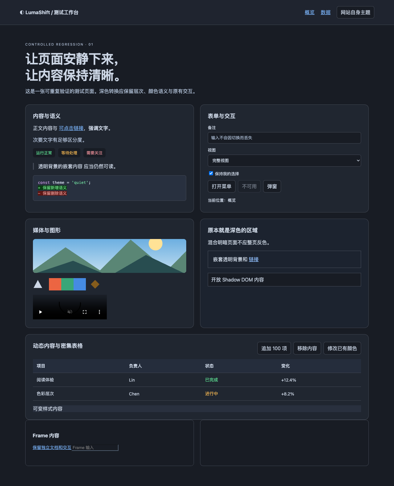
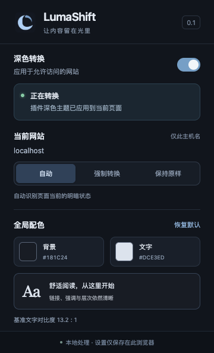

<p align="center">
  
</p>

# LumaShift

自然的深色网页，本地处理。

LumaShift 是 Chrome Manifest V3 扩展，使用独立样式规则引擎将亮色网页转换为深色，同时尽量保留内容层次、语义颜色、媒体原色和页面交互。生产运行时没有第三方 JavaScript 依赖。

[](https://github.com/ljayx/LumaShift/actions/workflows/ci.yml)
[](LICENSE)

当前版本 **0.1.0，开发中**。复杂网站仍可能存在局部显示问题，支持范围见下方说明，自动化检查结果见 [GitHub Actions](https://github.com/ljayx/LumaShift/actions/workflows/ci.yml)。

## 功能

- 自动转换亮色页面，尽量跳过已经呈现深色的网页。
- 按网站选择「自动」「强制转换」或「保持原样」。
- 实时调整全局背景色与文字色，一键恢复默认配色。
- 处理动态内容、常见 CSS 规则、开放 Shadow DOM 和文本选中高亮。
- 关闭时撤销扩展修改，保留网站自身发生的主题和内容变化。
- 设置保存在本地，没有账号、遥测或云服务，详见[隐私与权限](PRIVACY.md)。

## 预览

以下为本地测试页与扩展控制面板的实际截图。

<p>
  
  
</p>

## 安装

需要 **Node.js 22+**、npm 和桌面 **Chrome 120+**。最低 Chrome 版本尚未单独验收，建议使用当前稳定版。

```bash
git clone https://github.com/ljayx/LumaShift.git
cd LumaShift
npm ci
npm run build
```

1. 打开 `chrome://extensions`，开启「开发者模式」。
2. 点击「加载已解压的扩展程序」，选择生成的 **dist** 文件夹。
3. 将 LumaShift 固定到工具栏，打开普通 HTTP/HTTPS 网页。
4. 允许扩展访问需要转换的网站；若限制为「点击时」，自动转换会受限。

扩展默认开启。已有网页在安装或重新授权后会尝试直接注入；开发更新后如旧标签页提示连接已断开，请刷新标签页。多个主题转换扩展同时开启可能互相覆盖。

## 使用

| 控件 | 行为 |
|---|---|
| 全局开关 | 控制所有页面，关闭后保留网站设置 |
| 自动 | 根据页面当前颜色判断是否转换 |
| 强制转换 | 始终应用扩展主题，可覆盖自动误判 |
| 保持原样 | 当前网站不转换 |
| 背景 / 文字颜色 | 更新全局配色，低对比度会提示 |
| 恢复默认 | 只恢复配色，不清除网站规则 |

网站规则按顶层页面的完整主机名保存，子域名分开。Chrome 内部页、扩展商店、PDF 阅读器、file 页面和无痕模式不在支持范围。

部分复杂 CSS、封闭 Shadow DOM、动态替换的 adoptedStyleSheets、无法读取或超过 2 MiB 的样式表可能无法完整转换。图片、Canvas、WebGL 和视频内容不会重新着色；图片上的文字、混合模式及透明元素仍可能有局部可读性问题。自动识别不准确时，可通过网站规则选择「强制转换」或「保持原样」。

## 开发与测试

```bash
npm run check
PLAYWRIGHT_BROWSERS_PATH=.cache/browsers npx playwright install chromium
PLAYWRIGHT_BROWSERS_PATH=.cache/browsers npm run test:browser
```

Linux 缺少系统依赖时使用 `npx playwright install --with-deps chromium`。上面的环境变量语法适用于 macOS/Linux；Windows 可先设置同名变量，Windows 流程尚未验证。

| 命令 | 用途 |
|---|---|
| `npm run build` | 构建 dist/，检查生产包输入 |
| `npm test` | 颜色、声明解析、设置单元测试 |
| `npm run test:browser` | 顺序运行核心、暗色规则、背景层次、文本选择回归 |
| `npm run test:perf` | 比较未加载扩展、关闭转换、开启转换三种状态 |
| `npm run test:sites` | 访问公开网站抽查兼容性，需要网络 |
| `npm run profile` | 记录 LumaShift 的 CPU profile |
| `npm run report` | 将本地回归和可选性能数据汇总到 test-results/report.md |
| `npm run serve` | 启动手工测试页 http://localhost:4173 |

浏览器测试共用 4173 端口，使用临时独立浏览器资料，不读取个人 Chrome 数据。请顺序执行，性能测试应单独运行。测试结果、截图与 profile 写入 test-results/，不提交 Git；GitHub Actions 保存回归证据和可加载的扩展产物。

性能脚本记录首屏、切换、主线程 CPU、GC 后 JS 堆、进程 RSS 和多标签页开销。测量口径随原始数据和本地报告输出，不能推广为全部网站、严格冷启动或数小时运行结论。

## 代码结构

```text
src/              扩展源码、Popup 和图标
scripts/          构建、浏览器测试和性能工具
tests/            单元测试和可控 HTML/CSS 页面
assets/           图标源图与展示截图
licenses/         开发工具许可证
```

## 贡献与许可

欢迎提交 [Issue](https://github.com/ljayx/LumaShift/issues) 和 Pull Request，开发约定见 [CONTRIBUTING.md](CONTRIBUTING.md)。

本项目采用 [MIT 许可证](LICENSE)。开发工具 esbuild 使用 [MIT 许可证](licenses/esbuild-MIT.txt)，Playwright 使用 [Apache-2.0 许可证](licenses/Playwright-Apache-2.0.txt)；它们不随扩展分发。间接依赖的许可保留在各 npm 包中，Chromium 的许可随浏览器发行包保留。图标源图位于 assets/branding/，由生成式图像工具创建。
